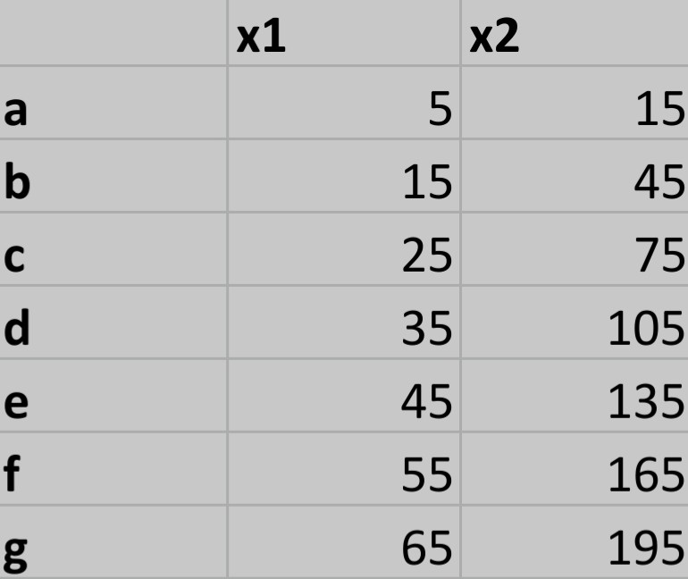

# Numerical_Processes 🤖
This repository will be implemented as a documentary site for the practical works of the course: numerical processes. The team will evaluate real research problems using the different methods learned during the semester: equations of one variable, systems of equations, and interpolation. 

## The team 👩🏻‍💻👨‍💻

We are bachelor's students in production and mechanical engineering.

* **Pablo Marulanda** 
* **Sara Mejía** 
* **Sergio Salazar** 
* **Susana Tilano** 

## *Let's start* 🚀
### Case of study #1 
The Colebrook-White equation es the relationship between the friction factor and the reynolds number in which appears the pipe diameter and its roughness. It`s usefulness is to find the friction factor for the sample given. The factors that this depends on may change with the material or the place where it is in, most of the things are implied in the formula that shows exactly what the value of the friction is. For the accuracy of the result, we use 7 mathematical methods to iterate and find the closest value of the actual result. This is a system that can be fastly solved with this methods to find the friction factor of the pipe that carries the fluid. 

#### For:
f- Friction factor \
ε- rugosity of the surface layer (m)\
μ - Dynamic viscidity (Pa/s) \
D- Diameter of the pipe (m)\
Re- Reynolds number 

For the equation:\

#### For finding Reynolds Number:
V- Speed of the fluid (m/s)\
D- Diameter of the pipe (m)\
d- Density of the fluid (Kg/m^3) \
μ- Dynamic viscidity (Pa/s)

For the equation:\

### Case of study #2
A manufacturing plant produce high quality diverse biscuits, for that, the layout consists of four sublines of production: black chocolate, white chocolate, cream & cookies, and coffee references.
All the refences are done by the same four subprocesses. (Mixing, baking, cooling, packaging). The enterprise biscuit’s formula stipulates that each reference must have the same base time/1000 units in each one of them to always accomplish the best quality.

Depending on the reference a time adjusment factor is considered as following:

The operators know the total time of production of each reference as well, but they lost the base times documentation.

The company needs a program that help the operators re-write the base times documentation and start producing again soon.

## Case of study #3

A company needs to make plastic chairs, for this, they need to buy plastic injection machines that can satisfy the required processing time so that their manufacture is the most profitable and effective.

The manufacturer has a table that indicates by machine number it makes certain quantities of chairs and is as follows:

where x1 is the number of machines and x2 is the number of chairs made per minute

taking into account the previous table, we see that due to the budget it is necessary to buy 40 machines.

we take this block where we see that it is within the number of machines that we request.

This is the formula used:

and thus concludes how many chairs can be made in 1 minute by 40 machines.

## *Repository explained* 🛠️

For Case of study #1 you will find the following methods for solving equations of one variable:

[1.Bisection](https://github.com/Stilanof/Numerical_Processes/blob/58017f2d3057bfe747b59035cb9969acdd0c108c/Codigos/Biseccion.m)

[2.Fixed point](https://github.com/Stilanof/Numerical_Processes/blob/1dc7c505c04a33a0b116df171c9ad64c2b41d914/Codigos/pf.m)

[3.Regula falsi](https://github.com/Stilanof/Numerical_Processes/blob/1dc7c505c04a33a0b116df171c9ad64c2b41d914/Codigos/ReglaFalsa.m)

[4.Newton](https://github.com/Stilanof/Numerical_Processes/blob/1dc7c505c04a33a0b116df171c9ad64c2b41d914/Codigos/newton.m)

[5.Newton1](https://github.com/Stilanof/Numerical_Processes/blob/1dc7c505c04a33a0b116df171c9ad64c2b41d914/Codigos/newton1.m)

[6.Newton2](hhttps://github.com/Stilanof/Numerical_Processes/blob/1dc7c505c04a33a0b116df171c9ad64c2b41d914/Codigos/newton2.m)

[7.Secant](https://github.com/Stilanof/Numerical_Processes/blob/1dc7c505c04a33a0b116df171c9ad64c2b41d914/Codigos/secante2.m)

For Case of study #2 you will find the following methods for solving systems of equations:

[1.Gaussian elimination (simple,partial pivot and total pivot)](https://github.com/Stilanof/Numerical_Processes/blob/main/study_case2/Gaussian%20elimination.m)

[2.Iterative methods Jacobi-Gauss-Seidel](https://github.com/Stilanof/Numerical_Processes/blob/main/study_case2/Iterative_methods_Jacobi_Gauss_Seidel.m)

[2.2 Matricial Jacobi-Gauss-Seidel](https://github.com/Stilanof/Numerical_Processes/blob/main/study_case2/Matricial_JacobiSeid.m)

[3.Iterative methods (SOR)](https://github.com/Stilanof/Numerical_Processes/blob/main/study_case2/SOR.m)

For Case of study #3 you will find the following methods for interpolation:

[1.Vandermonde](https://github.com/Stilanof/Numerical_Processes/blob/main/study_case3/1.%20Vandermonde.m)

[2.Newton (Divided difference method)](https://github.com/Stilanof/Numerical_Processes/blob/main/study_case3/2.%20Newton.m)

[3.Spline (linear, square and cubic)](https://github.com/Stilanof/Numerical_Processes/blob/main/study_case3/3.%20Spline.m)
